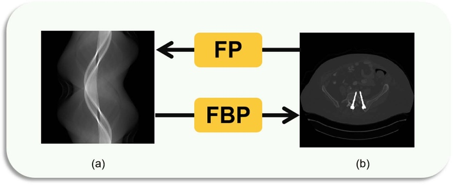
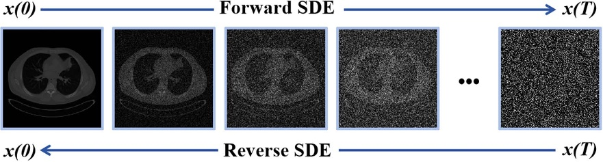
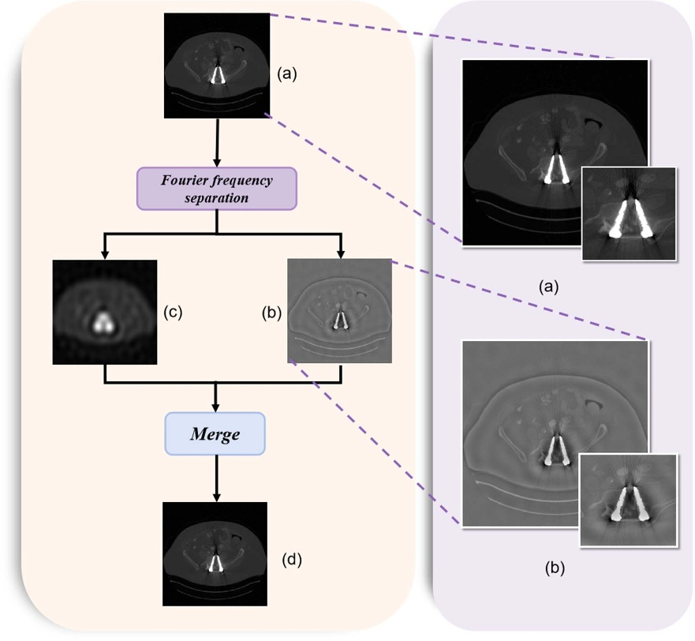
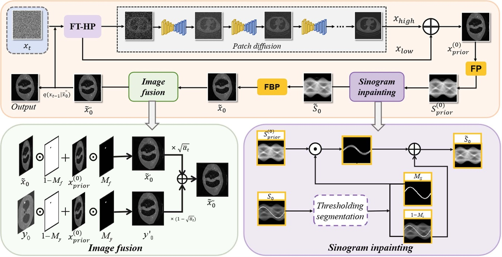
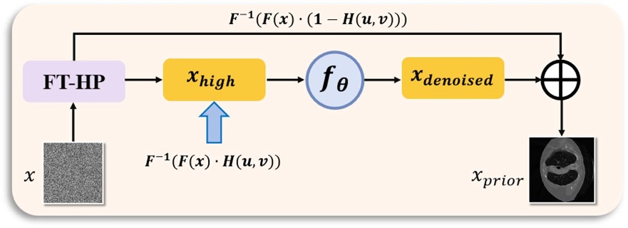
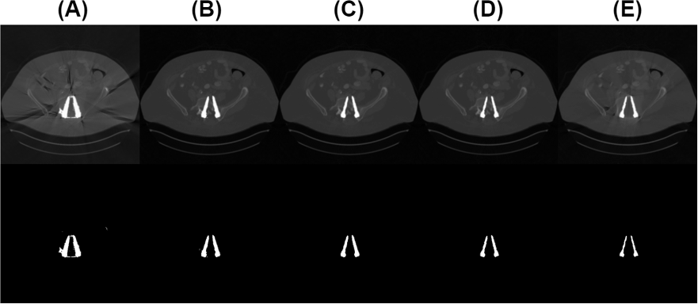
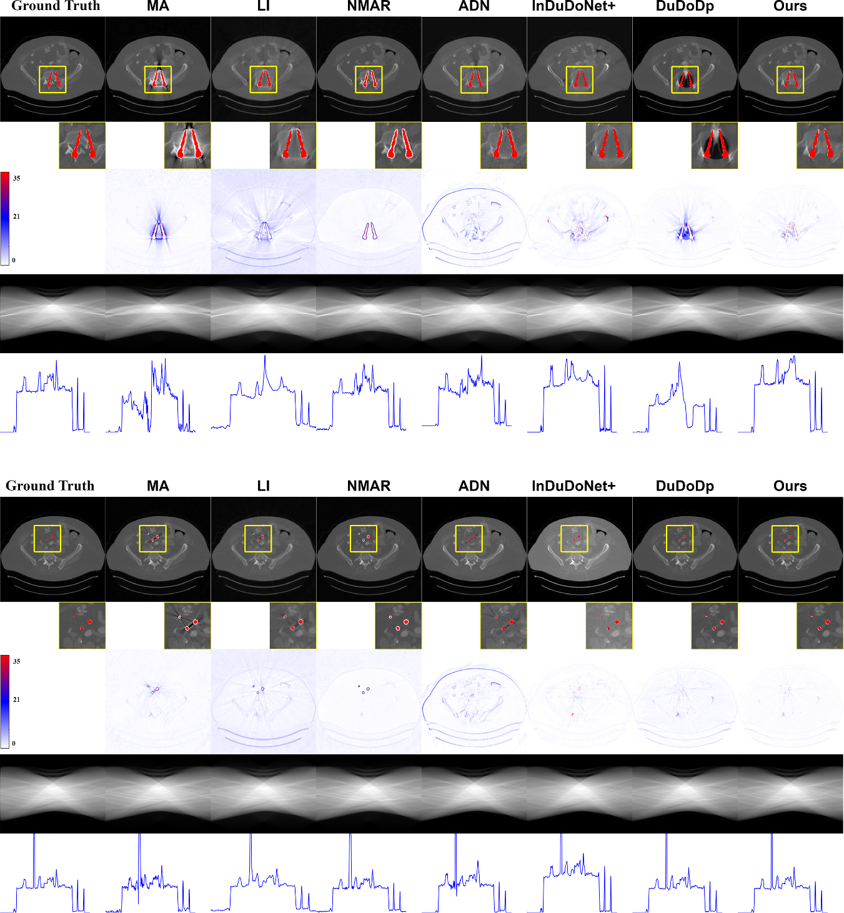
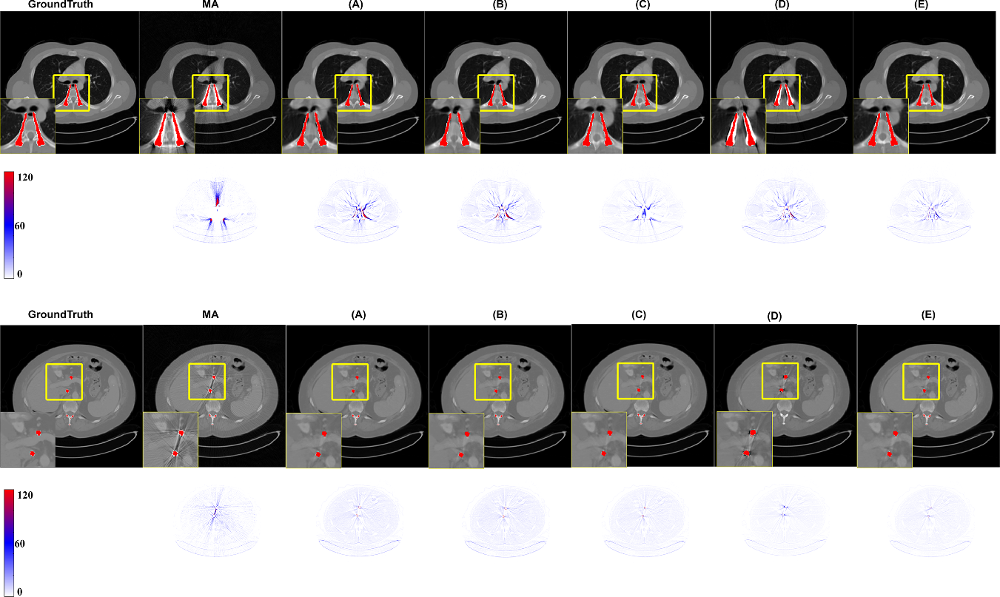
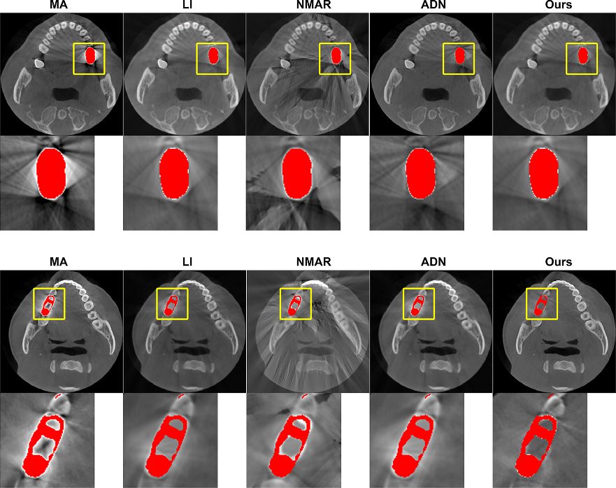

# TDMAR-Net: A Frequency-Aware Tri-Domain Diffusion Network for CT Metal Artifact Reduction
[](https://iopscience.iop.org/article/10.1088/1361-6560/ae0efc)
[](https://opensource.org/licenses/MIT)
This repository contains the PyTorch implementation of the paper **"TDMAR-Net: a frequency-aware tri-domain diffusion network for CT metal artifact reduction"**.
> **Code Availability:** The source code is available at [https://github.com/yqx7150/TDMAR-Net](https://github.com/yqx7150/TDMAR-Net).


## Abstract
Metal implants and other high-density objects cause significant artifacts in computed tomography(CT) images, hindering clinical diagnosis. Traditional metal artifact reduction methods often leave residual artifacts due to sinogram edges discontinuities. Supervised deep learning approaches struggle due to reliance on paired data, while unsupervised methods often lack multi-domain information. In this paper, we propose TDMAR-Net, a diffusion model-based three-domain neural network that leverages priors from projection, image, and Fourier domains for removing metal artifact and enhancing CT image quality. To enhance the model’s learning capability and gradient optimization while preventing reliance on a single data structure, we employ a two-stage training strategy that combines large-scale pretraining with masked data fine-tuning, improving both accuracy and adaptability in metal artifact removal. The specific process is to adjust the weight of the high frequency and low frequency components of the input image through the high pass filter module in the Fourier domain, and process the image into blocks to extract the diffusion prior information. The prior information is then introduced iteratively into the sinogram and image domains to fill in the metal-induced artifacts. Our method overcomes the challenges of information sharing and complementarity across different domains, ensuring that each domain contributes effectively, thereby enhancing the precision and robustness of metal artifact elimination. Experiments show that our approach superior to existing unsupervised methods, which we have validated on both synthetic and clinical datasets.

## Key Features
* **Tri-Domain Processing:** Extends traditional dual-domain learning by explicitly modeling features in the **Sinogram**, **Image**, and **Frequency** domains to fully capture artifact characteristics.
* **Dual-Domain Diffusion Model (DDDM):** Utilizes parallel diffusion processes in both sinogram and image spaces to generate complementary generative priors, reducing the gap between metal-affected and artifact-free distributions.
* **Frequency-Aware Fusion (FAFN):** A refinement module that fuses the diffusion priors. It employs discrete wavelet transform (DWT) within **Frequency-Aware Blocks (FAB)** to treat high-frequency texture information and low-frequency structural components distinctively.
* **Detailed Texture Preservation:** By focusing on frequency components, the model avoids the common pitfall of over-smoothing adjacent tissues near metallic implants.

## Preliminary
<p align="center">
  
  <br>
  <em>Figure 1: Illustration of the relationship between the sinogram domain and the image domain. (a) Sinogram; (b) reconstructedCT image using filtered back projection (FBP); back projection (FP) enables mapping from image domain to sinogram domain.</em>
</p>

<p align="center">
  
  <br>
  <em>Figure 2: Forward and reverse processes in diffusion models. The rightward process shows progressive noise injection in the sinogram domain, simulating forward diffusion. The leftward process demonstrates denoising from noisy input back to a clean sinogram, representing the reverse generation process.</em>
</p>

## Method Overview
<p align="center">
  
  <br>
  <em>Figure 3: Illustration of the Fourier frequency separation and fusion process. The original image (a) is decomposed into high frequency (b) and low-frequency (c) components via Fourier-based filtering. These components are then merged (d) to preserve
global fidelity while highlighting metal artifacts, particularly along edges.</em>
</p>

<p align="center">
  
  <br>
  <em>Figure 4: Illustrates the architecture of our proposed metal artifact removal model. The model integrates three domains—Fourier, image, and sinogram—to enhance artifact removal. High-frequency components are extracted in the Fourier domain,inpainting using diffusion priors, and fused dynamically to improve reconstruction accuracy and consistency.</em>
</p>

<p align="center">
  
  <br>
  <em>Figure 5: Schematic of the high pass filtering and denoising process. The input image x undergoes Fourier transform and frequency separation, where the high frequency component xhigh is denoised by a neural network fθ. The denoised output is fused with the retained low frequency component to obtain the prior image xprior, preserving image fidelity while reducing metal artifacts.</em>
</p>

## Results
<p align="center">
  
  <br>
  <em>Figure 6: Robustness analysis of metal mask threshold selection. Reconstruction results (top row) and corresponding metal masks (bottom row) using five different threshold values. From left to right (A)–(E), the thresholds are 2200, 2500, 2600 (optimal),2700, and 3000.</em>
</p>

<p align="center">
  
  <br>
  <em>Figure 7: Comparison of different MAR methods on the synthesized DeepLesion dataset with metallic implants of various sizes.From top to bottom: reconstructed CT images, corresponding sinograms, and intensity profiles extracted along the central horizontal line of the full image. PSNR (dB)/SSIM below is for reference. The display window is [−175, 275] HU.</em>
</p>

<p align="center">
  
  <br>
  <em>Figure 8: The visual effects of our MAR methods using different modules, where the amplifier parts indicate metallic implants.(A–E) correspond to the experimental setups in table 4. The display window is [−175, 275] HU.</em>
</p>

<p align="center">
  
  <br>
  <em>Figure 9:Comparison of different MAR methods on the clinical dataset of patients undergoing oral and maxillofacial examinations with metallic structures of various sizes. The display window was set to [−175, 275] HU.</em>
</p>

<p align="center">
  
  <br>
  <em>Figure 10: Visual results of different MAR methods on Yofo dental dataset with metallic implants. The display window was set to[−175, 275] HU.</em>
</p>


## Acknowledgements
We gratefully acknowledge the Stomatology Center of The First Affiliated Hospital of Nanchang University and YOFO Medical Technology Co., Ltd for providing the clinical CT datasets used in this study. We also acknowledge the DeepLesion (Yan et al 2018) dataset and the CNNMAR method (Zhang and Yu 2018), which supported our synthetic data generation. This work was supported by the National Natural Science Foundation of China (Nos. 621220033 and 62201193).


## Citation
```bibtex
If you use this code or find our work useful, please cite:
@article{chen2025tdmar,
  title={TDMAR-Net: a frequency-aware tri-domain diffusion network for CT metal artifact reduction},
  author={Chen, Wenzhuo and Yu, Bing and Liao, Jamei and Wang, Tao and Shi, Liu and Liu, Qiegen},
  journal={Physics in Medicine \& Biology},
  volume={70},
  number={215019},
  year={2025},
  publisher={IOP Publishing}
}
